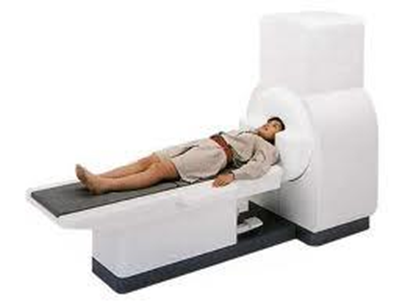
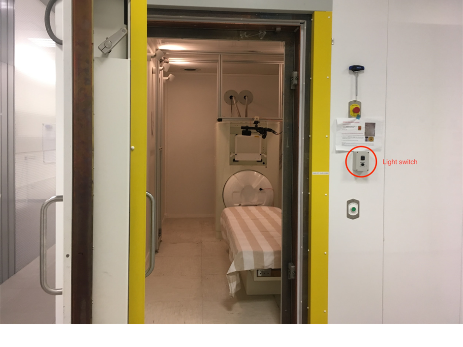
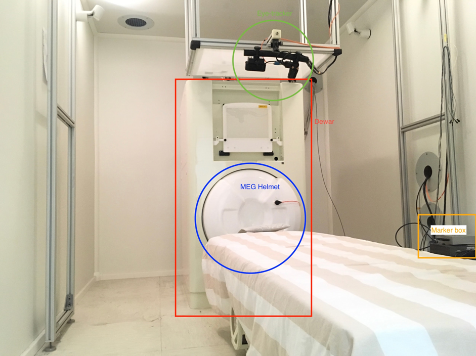
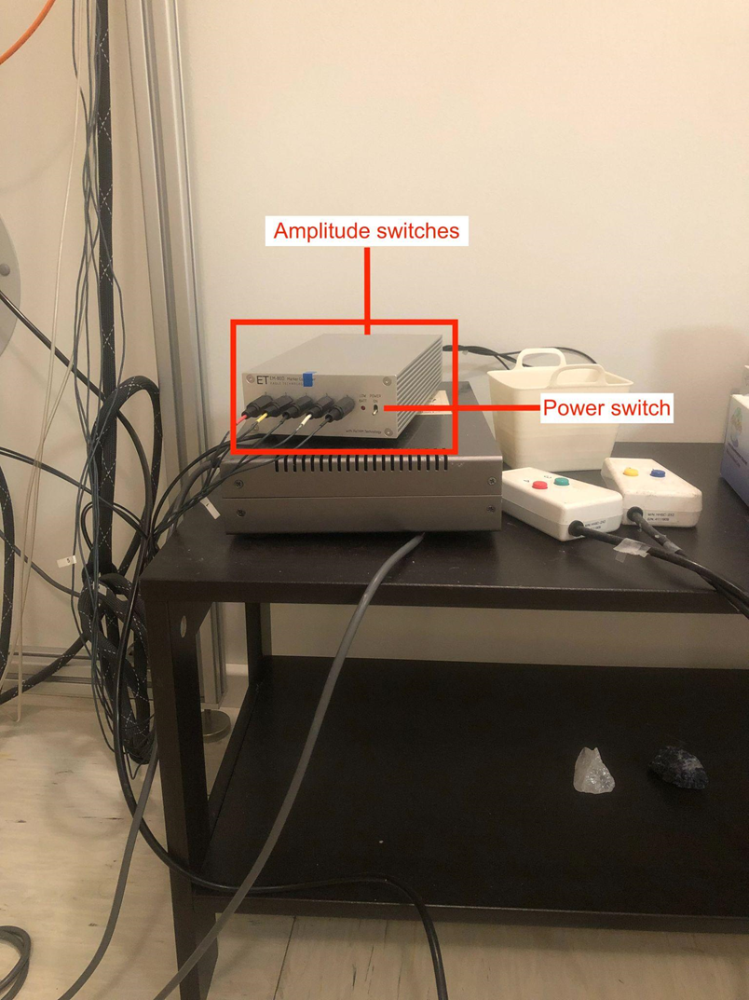
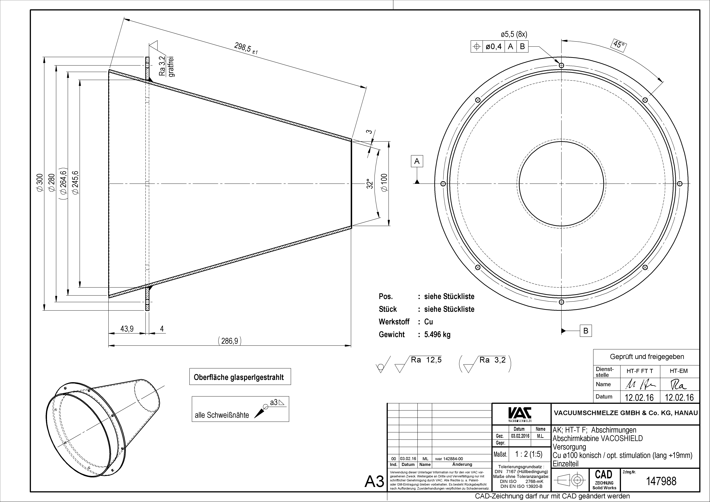

***********************************
MEG System description: KIT Machine
***********************************

System Overview
###############

MagnetoEncephaloGraphy (MEG) systems are machines capable of measuring the magnetic field generated by the brain.
They provide high temporal and spatial resolutions. They are non-invasive, similar to a microphone listening to your voice, MEG listens for the brain activity.
MEGs are equipped with highly sensitive sensors called SQUIDs. In order for SQUIDS to operate, they need to be cooled down to -277 degres, to achieve this temperature
liquid Helium is needed.
Unlike MRI, MEG cannot show the anatomical structure of the brain, therefore MRI scans are combined with MEG measurements to identify the parts of the brain responsible for the measured brain activity.
The magnetically shielded room is a product of Vacuumschmelze (Hanau, Germany). The shielding effect is provided by two layers of mu metal; the inner layer is 3 mm and the outer layer is 2 mm thick. Predicted shielding performance was rated to be -60 dB at 1 Hz; actual performance exceeds this prediction. The exterior dimensions of the room are 2.9 x 3.5 x 2.9 m, and the inner dimensions are 2.4 x 3.0 x 2.4 m.
We refer to our system as having 160 channels, but in actuality it contains:
157 axial gradiometers used to measure brain activity,
3 orthogonally-oriented (reference) magnetometers located in the dewar but away from the brain area, used to measure and reduce external? noise offline, and
32 open positions, of which we currently use 8 to record stimulus triggers and the other 24 channels to record Eye Tracker data directly, auditory signals from our mixer and vocalization information from our optoacoustic fiber-optic microphone.

The system is located inside a magnetically shielded room. KIT refers to Kanazawa Institute of Technology, the manufacturer of the system.

NYUAD MEG system uses liquid helium to keep our SQUID sensors cold (-269°C, -452°F).
If the helium tank leaks, the liquid helium will immediately boil off.
This can cause rapid suffocation and severe frostbite. Handle with care.
Especially don’t shock the dewar.
If you feel anything strange while doing an experiment (i.e., you suspect a helium leak), open the MSR and release
the subject immediately.  Do not leave the room with a subject in the MSR.

LAB setup
#########

Computers:

- MEG Control PC: used to acquire the MEG data. Do not use the MEG control computer (MEG CONTROL) except for MEG use.

Most importantly, do not install any software. This may cause the system to not work properly.

- stimulus1 pc: used to run the experiment
- stimulus 2 pc: used to put the experiment

Lab setup: Inside the MSR
-------------------------

The MSR is equipped with dimmable 6 halogen light bulbs. Replacement ones are found in the lab incase of needing to change.
Backup battery is located in one of the office spaces connected via yellow cables

- Lights: switch is located by the door
- Dewar: contains liquid helium that submerges SQUID sensors spread across the helmet
- Foam insert headphones: allows participants to get audio stimulus but also audio indications from the operator
- Marker box: connects the head position indicator coils (marked with 5 colours)
- Heater cable: keeps frost and ice from forming on DEWAR; switch is located at the back of the MSR
- Projector: back-projects stimulus onto a screen; remote control is outside the room.
- Amplitude switches: controls the signal strength of the marker coils

Legacy system (Older system)
----------------------------
The hardware components constituting the (legacy) MEG system:

Vpixx system (New system)
-------------------------

Screen width 65 cm

MEG-Channels
############

Channels 0 to 207: Gradiometers squids

Channels 208-223: Magnetometers for reference magnetic field (these are used to denoising and to understand the ambiant magnetic field the environment)

224: Lightsensor 1

225: Lightsensor 2

228: Microphone

229: Event marker bit 0

230: Event marker bit 1

231: Event marker bit 2

One of the channels (In the 80's ) displays a digital signal, this is because one of the sensors are shut off and not used.
Processing pipeline should include this exclusion and not process data from this channel.
(channel name to be identified).

MEG-Racks
#########

The KIT-MEG system has 7 racks

.. image:: ../graphic/KIT-Racks.png
  :alt: MEG Racks System

MSR: Magnetically Shielded Room
###############################

The KIT-MEG is located in an MSR built by `VacuumShmelze <https://www.vacuumschmelze.com/>`_

.. image:: ../graphic/meg-kit-daq.png
  :alt: Data acquisition interface (DAQ) of KIT MEG

- Consists of four PCs working together, interfacing with MEG160 during data acquisition.
- The DAQ units are located in a cabinet labeled “DAQ”.
    - The units are labelled as ‘DAQ0’, ‘DAQ1’, ‘DAQ2’, and ‘DAQ3’.
    - The last time the system battery for DAQ0 was changed on February 4, 2020.
    - Once changed, the BIOS settings might need to be updated. To enter the setting page, strike F2 while the system is booting.
        - Make sure Power Management is Enabled.
        - Make sure Low Power Mode is Disabled.
    - In case one/some of the DAQs won’t boot, try turning it on by manually pressing the power button on the unit.
    - Inform other lab members if things like that happen. Chances are, they have encountered similar/same problems.

Frequently asked questions (FAQ)
################################

- Does locking the SQUID sensors and opening the MSR door can cause harm to the SQUIDs?

When you open the MSR door with SQUIDs locked, the output of some
sensors may become flat. But they are not dead but just faint away due
to the excessive magnetic field fluctuation by swinging the door. The
function of the sensors come back when they are once unlock and lock
again with the door closed.

- How to test trigger channels while opening the MSR?

Avoid locking the sensors, keep the MSR door open and perform all tests with Vpixx response boxes, microphone and other hardware to test your experiment

Contact
#######

.. list-table::
   :widths: 25 25 25 25
   :header-rows: 1

   * - Name
     - Email
     - Number
     - Role
   * - Hadi Zaatiti
     - hz3752@nyu.edu
     - +971 56 275 4921
     - Research Scientist
   * - Osama Abdullah
     - osama.abdullah@nyu.edu
     - NA
     - Senior Scientist
   * - Yoshiaki Adachi
     - adachi@ael.kanazawa-it.ac.jp
     - NA
     - MEG-KIT machine constructor reference
   * - Jun Kawai
     - j-kawai@neptune.kanazawa-it.ac.jp
     - NA
     - MEG-KIT machine constructor reference

References
##########

The following is a list of references for further understanding on MEG systems

* MNE-Python: Overview and tutorials
    * https://mne.tools/stable/auto_tutorials/intro/10_overview.html#sphx-glr-auto-tutorials-intro-10-overview-py

* Marijn van Vliet's "Introduction to MNE-Python"
    * https://mybinder.org/v2/gh/wmvanvliet/neuroscience_tutorials/master?filepath=mne-intro%2Findex.ipynb

* Processing and analysis scripts from various Nellab members/alumni
    * https://github.com/benebular/mne-python-preproc-templates
    * https://github.com/jdirani/MEGmvpa
    * https://github.com/jdirani/mne-preprocessing-template
    * https://github.com/jdirani/meg-analysis-templates
    * https://github.com/grahamflick/Nellab-MRI-Pipeline
    * https://github.com/grahamflick/Tools-for-Combined-MEG-and-Eye-tracking

* Kit2fiff and ICA examples:
    * https://docs.google.com/document/d/1zoxPCngUmyXuKYTNWM8W-_ncTld9okRuYncGXdVUtV0/edit?usp=sharing
    * https://docs.google.com/document/d/1OrVP9ts1gTGB5fhzx8YcK3JKZQgm0HM4Ic3hKtVzHzA/edit?usp=sharing
    * https://docs.google.com/document/d/1X9Tj28ekJ93TubJ52TnrebDvIh8zeXHLp2aMURNV40Y/edit?usp=sharing

* Books:
    * Hansen, Peter & Kringelbach, Morten & Salmelin, Riitta. (2010). MEG: An introduction to methods. 10.1093/acprof:oso/9780195307238.001.0001.