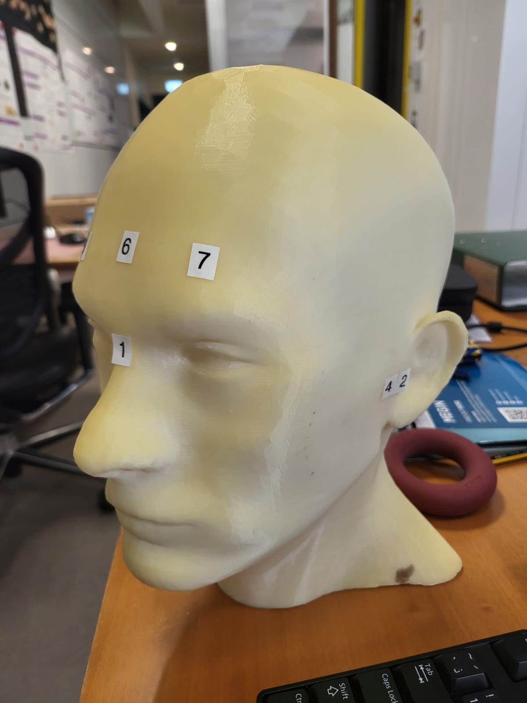
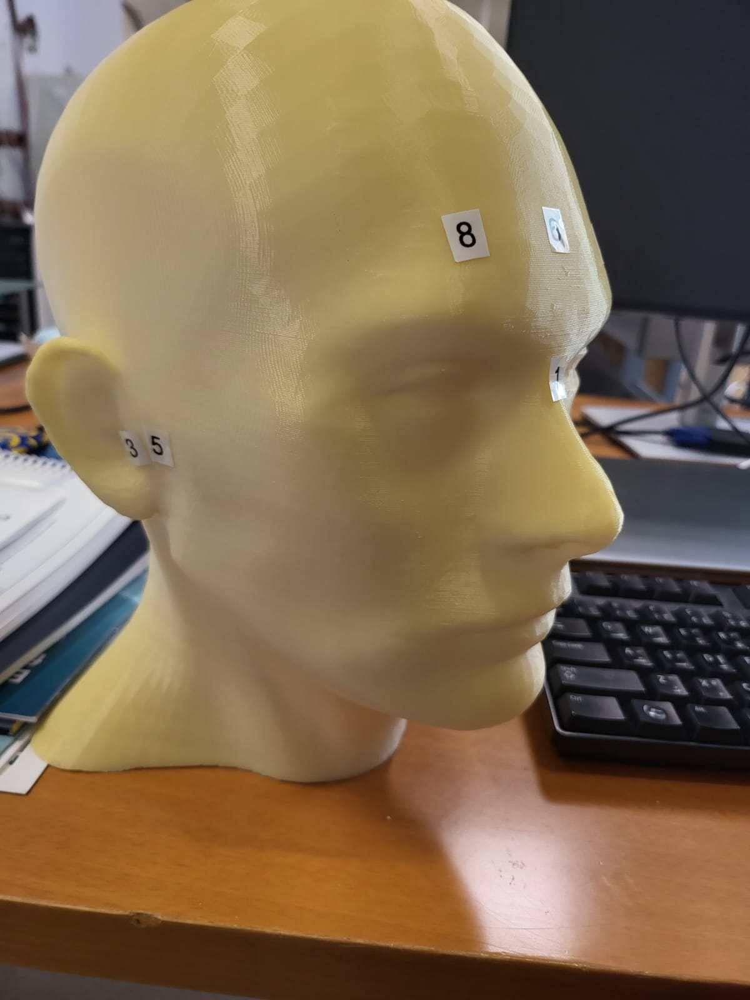

Operation Protocol
==================
Lead author:

Advice to participants: 1.	Don’t bring any magnetic things (e.g., a magnet) into the MSR.
Strong magnetic fields may cause damage to the MEG sensors.

Step 1 is to acquire a scan of the head surface generating a .ext (to be added) file for the participant

.. raw:: html
    :file: ../graphic/operation_protocol.drawio.html

Step 2 is to

.. raw:: html
    :file: ../graphic/meg_data_generation.drawio.html

Stylus location and markers
---------------------------

The following table sumarises the position of each registered stylus location and whether or not a KIT coil will be placed on that position.

+-------+-----------------+-----------------+
| Index | Body Part       | Has Marker coil?|
+=======+=================+=================+
| 1     | Nosion          |  NO             |
+-------+-----------------+-----------------+
| 2     | Left Traps      |  NO             |
+-------+-----------------+-----------------+
| 3     | Right Traps     |  NO             |
+-------+-----------------+-----------------+
| 4     | Left Ear        |  YES            |
+-------+-----------------+-----------------+
| 5     | Right Ear       |  YES            |
+-------+-----------------+-----------------+
| 6     | Center Forehead |  YES            |
+-------+-----------------+-----------------+
| 7     | Left Forehead   |  YES            |
+-------+-----------------+-----------------+
| 8     | Right Forehead  |  YES            |
+-------+-----------------+-----------------+

Booking system and scheduling
-----------------------------

While scheduling your experiment, avoid rush hours 8:30am and 5:30pm

 rush hour has alot of noise avoid experiments during this time